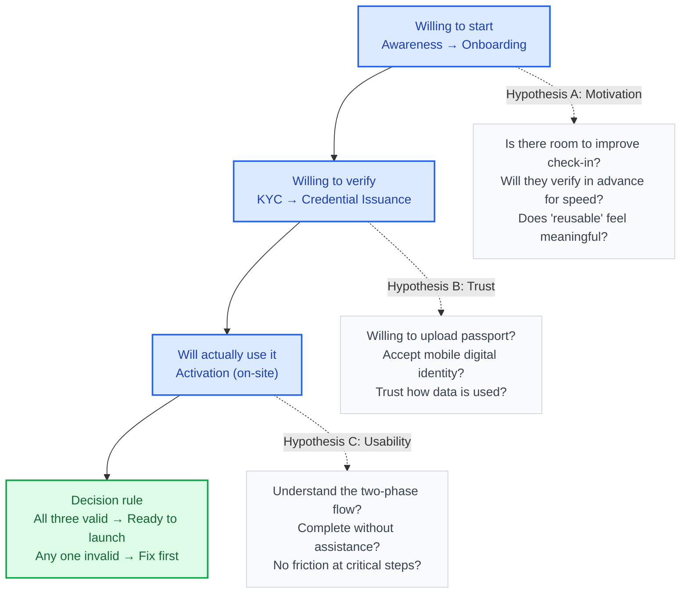

## Background & Business Context

Japanese hotels have long adopted self-service kiosks, but **identity verification still requires presenting a physical passport**.

Even with self-service kiosks, travelers still need to produce their passport — and this verification is **one-time and non-reusable**, requiring passport re-verification at every check-in.

**Taiwan is one of Japan's largest inbound travel markets**:

- Taiwanese travelers alone account for approximately **33,000 hotel check-ins per day** in Japan
- DNP's hotel network already covers **1,000+ hotels**, providing a foundation for scalable deployment
- The verification action has revenue potential, with hotels paying per successful verification

Taiwanese travelers — characterized by high travel frequency, predominantly independent travel, and mobile-savvy behavior — represent the ideal first market for reusable digital identity.

> Turing Space is fundamentally a company built around digital credential issuance, custody, and verification, with a complete service foundation for issuing, storing, and verifying credentials.
>
> Hotel express check-in is therefore not a standalone feature, but an extension of the existing platform into a high-frequency, real-world use case.
>
> **My view: every additional application context like this compounds user acquisition and digital credential volume on top of the existing foundation, strengthening the entire issuance-custody-verification ecosystem.**
>
> **If the hotel check-in use case succeeds, it opens the door to further expansion into car rental, tax refund, and other applications.**

---

## Challenges

1. **Digital passport must be simpler and faster to use than a physical passport**
1. **Sufficient incentive is needed for users to adopt it**
   1. Travelers must be willing to upload a sensitive document (their passport) to a company or service they may have never heard of
1. Requiring advance passport upload and KYC creates a natural drop-off point in the flow

---

## Design Strategy & Key Decisions

### 1. Split the Flow into Two Distinct Phases

I deliberately separated the task into two phases with **completely different contextual demands**:

- **Pre-departure →** Low urgency, easily ignored
  - Design focus: persuasion + guided onboarding to motivate users to complete registration and KYC before they leave
- **On-site →** Time-sensitive, low tolerance for error
  - Design focus: shortest possible path + high certainty — scan and done — with clear confirmation that verification succeeded

```
img:7
```

### 2. Context-Driven Landing Page for User Persuasion

The check-in landing page functions as a **reusable persuasion template** (the same structural pattern can be applied to future car rental and tax refund contexts).

The page is structured to increase user willingness to adopt:

- **Motivation**: Explain why the user should care
- **How it works**: Three simple steps explaining how to use it
- **Trust building**: Partner hotel brand wall (official endorsement) + privacy statement (data used solely for check-in)

```
img:2
```

### 3. Turning the Wait State into Part of the Flow

- **Active re-engagement touchpoint**: An email notification — "Passport verification successful" — sent upon approval to bring users back into the flow

```
img:4
```

### 4. Shortest Path for On-Site Use

Every additional step on-site is a friction point under the pressure of queuing and time constraints.

Once a user already holds a digital passport, the landing page **collapses all explanatory content and elevates the scan function to the highest hierarchy level**.

```
img:3
```

---

## Design Trade-offs

To get the verification feature shipped as quickly as possible, the scope of this version was determined collaboratively — aligning priorities with the PM and evaluating feasibility with engineering — to identify what could be intentionally simplified.

The most significant discussion was:

- **The landing page temporarily serves as both a marketing page and a product entry point**
  - Ideally, the marketing page (responsible for acquisition and persuasion) and the product entry point (for already-converted users) serve different tasks and different users — they should be separate
  - To ship a POC quickly and begin validation, this version merges both into a single page
  - First validate whether users will actually use it; once the POC is proven, split the product page and marketing page into their proper separate forms

```
img:5
```

To me, trade-offs are not forced compromises — they are deliberate judgments to keep progress on track. Focus resources on fast validation and POC; defer uncertain decisions to future iterations.

---

## Pre-Launch User Research

I designed and led a qualitative usability study to confirm: whether users would want to use it, trust it, and be able to use it successfully.

### Hypothesis Framework: A Motivation / B Trust / C Usability



### Participant Segmentation (MECE): Validate with the Most Likely Adopters First

A MECE segmentation using two dimensions — travel frequency × self-service check-in experience — to prioritize recruiting participants most likely to perceive the value:

- **Primary (recruit 4–5)**: **High-frequency (≥ 2 trips/year)** — most likely to feel the efficiency gain and understand the reusability value
- **Secondary (observe 2–3)**: **Low-frequency (< 2 trips/year)** — experienced but less frequent travelers
- **Excluded**: Group tour travelers who typically do not use self-service flows

### Methodology

- 1-on-1 interviews (approx. 60 minutes): first half covering motivation and trust, second half prototype task testing
- **Task 1**: Obtain a digital passport
- **Task 2**: Complete on-site check-in
- A/B Test comparing the current engineering-constrained version against my preferred user experience version, with participants experiencing and comparing both

### Using A/B Testing as a Design Decision Tool

```
img:9.gif
```

Design disagreements are inevitable — one person thinks one approach is better, another disagrees, and neither can convince the other. So I included both A and B versions in the study (with two separate prototypes), letting actual user responses resolve the question.

For me, the value of A/B testing is:

- Shifting "whose opinion is right" to "how users actually respond"
- Providing data to explain "why we designed it this way" when presenting to team members or stakeholders
- Uncovering blind spots neither side had considered

```
img:8
```

### Current Status

The usability study is ongoing — actively synthesizing behavioral observations and motivation/trust feedback from Taiwanese travelers. The next step is to complete the analysis and apply final design revisions to the landing page persuasion structure, KYC wait-state guidance, and on-site scan path. Interview participants include not only travelers but also Japanese hotel staff, giving us perspectives from multiple angles.

---

## Go-to-Market Strategy

Uploading a passport before departure is a low-urgency task that is easy to defer. The abstract benefit of "reusable in the future" is not enough to motivate action in the present.

The deeper challenge: without enough use cases, travelers have no reason to obtain a digital passport in advance — but with a small user base, it is not yet worth investing in building more use cases.

Our team's approach is to **not sell the long-term vision upfront, but give travelers a reason to act right now**:

> **Use small incentives to lower the barrier to first use**: offer a free eSIM (almost every traveler to Japan needs mobile data) or a complimentary hotel breakfast as a reward for completing digital passport setup.
>
> These incentives are highly relevant to Taiwanese travelers and cost-controlled on our end — turning "I'll do it later" into "I'll do it now."
>
> They also give the hardest step (uploading a passport before departure) its own immediate, standalone payoff.

---

## Outcomes

> ⚠️ This project is still in progress. The POC is being promoted and the official partnership with DNP Japan is expected to launch in December. Conversations with additional Japanese hotels beyond DNP are also underway. The following are **target metrics** and their derivation logic (pre-launch; to be validated after testing synthesis and go-live).

Tracking metrics are structured in two layers, each traceable back through the funnel:

- **Lagging indicator**: Successful hotel verifications, target 45/day.
- **Leading indicator**: Passport VC issuances, target 4,500/month.

Derivation logic (based on Taiwanese travelers): Estimated 33,000 Taiwanese travelers check into Japanese hotels daily; DNP covers 10% (3,300/day); conservative initial conversion rate of 4.5% → ~150 VCs/day → ~4,500/month; applying a 30% activation rate: 150 × 30% ≈ 45 verifications/day.

**The fact that we are actively in talks with Japanese hotels beyond DNP**
**itself validates the value of this experience as a reusable contextual template: the same design being adoptable across different hotel brands is precisely what this project set out to prove.**
